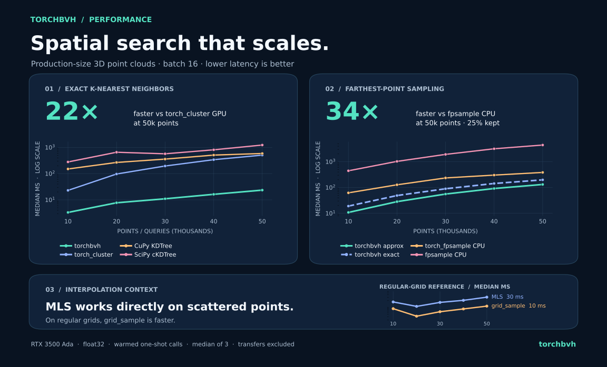

<h1 align="center"></h1>

**GPU geometry for PyTorch point clouds.** Fast k-NN, farthest-point sampling, interpolation, and ray tracing.

[](https://pypi.org/project/torchbvh/)
[](https://pypi.org/project/torchbvh/)
[](https://torchbvh.readthedocs.io/en/latest/)
[](LICENSE)

[Documentation](https://torchbvh.readthedocs.io/en/latest/) · [API reference](docs/api_reference.md) · [Benchmarks](examples/third_party_benchmarks.ipynb)

## Performance

**20x faster k-NN** than `torch_cluster` GPU and **9.2x faster approximate FPS** than `fpsample` CPU, averaged across all 20 benchmark workloads.



The plot shows batch 16, 3D, and 10k–50k points and queries. Speedups are geometric means over batch sizes 1 and 16, dimensions 2 and 3, and all five point counts. k-NN was also **22x faster** than CuPy KDTree GPU. MLS interpolates scattered points; on regular grids, `grid_sample` is faster. [Explore the full benchmark](examples/third_party_benchmarks.ipynb) · [Download the PNG](docs/assets/performance_story.png)

## About

`torchbvh` provides CUDA operations for 2D and 3D float32 point clouds, including fixed-size batches:

- **k-NN:** BVH-accelerated nearest-neighbor search.
- **FPS:** exact and bucketed approximate farthest-point sampling.
- **Interpolation:** moving least squares (MLS) over scattered point features.
- **Ray tracing:** segment and triangle intersections.

## Installation

Install CUDA-enabled PyTorch, a matching CUDA toolkit with NVCC, and a supported C++ compiler. To use the current code in this checkout:

```bash
python -m pip install --upgrade setuptools wheel
python -m pip install --no-build-isolation .
```

The [published PyPI release](https://pypi.org/project/torchbvh/) may trail this checkout. Install it with `python -m pip install --no-build-isolation --no-binary torchbvh torchbvh`. See the [build guide](docs/testing.md) for platform details.

## Quickstart

```python
import torch
import torchbvh as tb

points = torch.rand(10_000, 3, device="cuda")
queries = torch.rand_like(points)

with tb.BVH(points) as bvh:
    neighbors, distances_sq = bvh.knn(queries, k=4)

sample = tb.fps(points, target_tokens=2_500, mode="approx_bucketed")
features = torch.rand(10_000, 64, device="cuda")
values = tb.mls_interpolate(points, queries, features, k=4)
```

See the [examples](docs/examples.md) for exact FPS, ray tracing, and gradients.

## References

The BVH implementation builds on [Chitalu, Dubach, and Komura (2020)](https://doi.org/10.1111/cgf.13948) and [ImplicitBVH.jl](https://github.com/StellaOrg/ImplicitBVH.jl). Released under the [MIT license](LICENSE).
